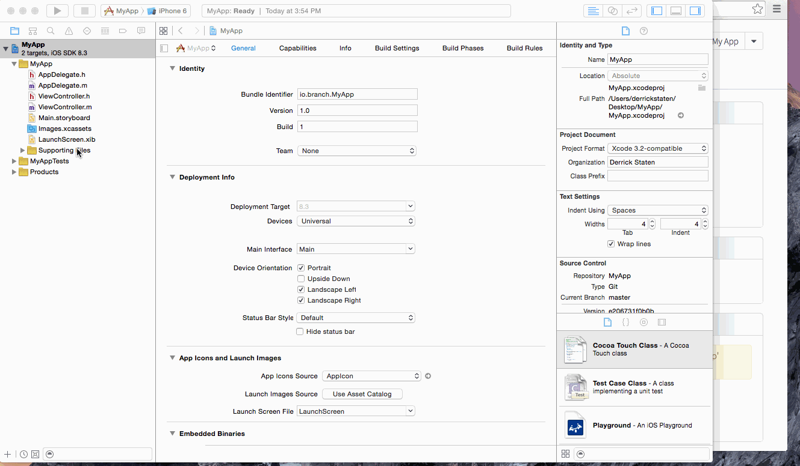

iOS Quickstart Guide
=====================================

This guide will help you integrate branch into your iOS app in as little time as possible.

## 1. Setting up your app on the Branch Dashboard

Our dashboard is the starting point for adding apps as well as tracking users of your app. 

To get started, point your browser to [https://dashboard.branch.io/](https://dashboard.branch.io/). If you haven't created an account before, you can signup and get taken through the basic setup right away. If you've signed up already, simply navigate to the [Summary](https://dashboard.branch.io/#) page and click the dropdown button in the top right. Choose "Create new app."


You will be prompted to enter a name for your new app. Do so and press "Create."


Navigate to the Settings page. Scroll down to App Store Information and search for your app by name--this is the same name listed on iTunesConnect. With this information, Branch will automatically redirect users without your app installed on their devices to the App Store.

In the case that your app cannot be found on the App Store (e.g. if you are distributing an enterprise app over the Internet, or you're not listed in the US app stores), you can also enter a custom URL by choosing "Custom URL to TestFlight/Other Host"


### Customizing the default social media (OG) tags for all links

This optional step will allow you to custom the default tags for all links to your app. While you can edit OG tags when creating links by including the appropriate key-value pairs in the link's data dictionary, it is a good idea to provide a default set of tags that will work for all links.

On the Settings page, scroll to Social Media - Open Graph. 

1. Enter your Facebook App ID (if you have one)
1. Enter the title you want displayed with the link
1. Enter a description of your app (recommended: two sentences)
1. Upload a thumbnail of your app

For more information on the optimal format for the title and description, see Facebook's [Sharing Best Practices](https://developers.facebook.com/docs/sharing/best-practices#tags).


### Register a URI scheme direct deep linking (optional but recommended)

You can register your app to respond to direct deep links (yourapp:// in a mobile browser) by adding a URI scheme in the YourProject-Info.plist file (or in Swift, Info.plist).

Also, in the instructions that follow, make sure to change **yourapp** to a unique string that represents your app name. You must choose a string and use the same one on the Branch Dashboard and in XCode.

Before jumping into XCode, you need to add the URI Scheme to the Branch Dashboard. On the [Settings](https://dashboard.branch.io/#/settings) page, scroll down to URI Schemes (advanced), click to expand, and add in the unique string you've chosen for your app (e.g. yourapp://). Be sure to press "Save" when you're finished.


Next, you'll need to open your project in XCode and complete the following.

	
1. Click on YourProject-Info.plist on the left (or in Swift, Info.plist).
1. Find URL Types and click the right arrow. (If it doesn't exist, right click anywhere and choose Add Row. Scroll down and choose URL Types)
1. Add "yourapp", where yourapp is a unique string for your app, as an item in URL Schemes as below:


Alternatively, you can add the URI scheme in your project's Info page.

1. In Xcode, click your project in the Navigator (on the left side).
1. Select the "Info" tab.
1. Expand the "URL Types" section at the bottom.
1. Click the "+" sign to add a new URI Scheme, as below:


## 2. Setting up Branch in your app

### Installing the SDK

There are multiple ways to install the Branch SDK. 

#### Available in CocoaPods

Branch is available through [CocoaPods](http://cocoapods.org), to install it simply add the following line to your Podfile:

    pod "Branch"

#### -or- Clone the Project

The Branch iOS SDK can be found at [https://github.com/BranchMetrics/Branch-iOS-SDK](https://github.com/BranchMetrics/Branch-iOS-SDK). To clone the repo from the command line:

	git clone https://github.com/BranchMetrics/Branch-iOS-SDK

#### -or- Download the raw files

Download code from here:
[https://s3-us-west-1.amazonaws.com/branchhost/Branch-iOS-SDK.zip](https://s3-us-west-1.amazonaws.com/branchhost/Branch-iOS-SDK.zip)

The testbed project:
[https://s3-us-west-1.amazonaws.com/branchhost/Branch-iOS-TestBed.zip](https://s3-us-west-1.amazonaws.com/branchhost/Branch-iOS-TestBed.zip)

#### Importing the SDK

If you are using Cocoapods you should skip this step.

You will need to drag and drop the Branch.framework file that you downloaded into your project. Be sure that "Copy items if needed" is selected.


**You also need to import CoreTelephony.** See the graphic below:


### Add your app key to your project

After you register your app, your app key can be retrieved on the [Settings](https://dashboard.branch.io/#/settings) page of the dashboard. Now you need to add it to YourProject-Info.plist (Info.plist for Swift).

1. In plist file, mouse hover "Information Property List" which is the root item under the Key column.
1. After about half a second, you will see a "+" sign appear. Click it.
1. In the newly added row, fill in "branch_key" for its key, leave type as String, and enter your app's Branch Key in the value column. (See the animated gif below for help finding your Branch Key on the Dashboard.)
1. Save the plist file.

##### Screenshot


##### Animated Gif


Branch must be started within your app before any calls can be made to the SDK. Modify the following two methods in your App Delegate:

### Starting a Branch session -- required for all SDK calls

##### Objective-C

```objc
#import <Branch/Branch.h>
```

```objc
- (BOOL)application:(UIApplication *)application didFinishLaunchingWithOptions:(NSDictionary *)launchOptions {
	// anything else you need to do in this method
	// ...

	Branch *branch = [Branch getInstance];
	[branch initSessionWithLaunchOptions:launchOptions andRegisterDeepLinkHandler:^(NSDictionary *params, NSError *error) {		// previously initUserSessionWithCallback:withLaunchOptions:
        if (!error) {
			// params are the deep linked params associated with the link that the user clicked -> was re-directed to this app
			// params will be empty if no data found
			// ... insert custom logic here ...   
        }
	}];
}
```

```objc
- (BOOL)application:(UIApplication *)application openURL:(NSURL *)url sourceApplication:(NSString *)sourceApplication annotation:(id)annotation {
	// pass the url to the handle deep link call
	// if handleDeepLink returns YES, and you registered a callback in initSessionAndRegisterDeepLinkHandler, the callback will be called with the data associated with the deep link
	if (![[Branch getInstance] handleDeepLink:url]) {
		// do other deep link routing for the Facebook SDK, Pinterest SDK, etc
	}
    return YES;
}
```

##### Swift
```swift
func application(application: UIApplication, didFinishLaunchingWithOptions launchOptions: [NSObject: AnyObject]?) -> Bool {
	// anything else you need to do in this method
	// ...
	
    let branch: Branch = Branch.getInstance()
    branch.initSessionWithLaunchOptions(launchOptions, andRegisterDeepLinkHandler: { params, error in
        if (error == nil) {
			// params are the deep linked params associated with the link that the user clicked -> was re-directed to this app
			// params will be empty if no data found
			// ... insert custom logic here ...   
        }
    })
        
    return true
}
```

```swift
func application(application: UIApplication, openURL url: NSURL, sourceApplication: String?, annotation: AnyObject?) -> Bool {
    // pass the url to the handle deep link call
    // if handleDeepLink returns true, and you registered a callback in initSessionAndRegisterDeepLinkHandler, the callback will be called with the data associated with the deep link
    if (!Branch.getInstance().handleDeepLink(url)) {
        // do other deep link routing for the Facebook SDK, Pinterest SDK, etc
    }
        
    return true
}
```

_Swift only: You need to include Branch in your bridging header. If you have not yet created a bridging header, add a new **Objective-C File** (Empty file works, name it anything you want). XCode will ask you if you want to create a new bridging header. Choose **Yes** and then delete the empty Objective-C file. Your newly created bridging header will be called **${YOUR-PROJECT}-Bridging-Header.h**. Add the following to that file:_

```
#import <Branch/Branch.h>
```


The deep link handler is called every single time the app is opened, returning deep link data if the user tapped on a link that led to this app open.

This same code also triggers the recording of an event with Branch. If this is the first time a user has opened the app, an "install" event is registered. Every subsequent time the user opens the app, it will trigger an "open" event.

**NOTE**: If you do not fully understand the params dictionary at this point, that is okay! In the 3rd part of this Quick Start guide, you will see how this empowers you to create a custom experience for your app's users, from the moment he or she clicks on a shared link.

##### Routing based on the link (optional)

One great use case for Branch is showing different view controllers and content based on what link the user just clicked on. The following implementation of _application:didFinishLaunchingWithOptions:_ looks at the params dictionary that is passed in and decides which view controller to present. If the user clicked on a Branch link with the parameter _pictureURL_ attached, the application redirects to a screen to view the picture. Otherwise the default view controller is shown. Obviously routing logic is heavily implementation-specific, so the code below is just an example. (See our iOS sample project [Branchster](https://github.com/BranchMetrics/Branchster-iOS) for another example of routing.)

```objc
- (BOOL)application:(UIApplication *)application didFinishLaunchingWithOptions:(NSDictionary *)launchOptions {
    
    // Initalize Branch and register the deep link handler
    // The deep link handler is called on every install/open to tell you if the user had just clicked a deep link
    Branch *branch = [Branch getInstance];
    [branch initSessionWithLaunchOptions:launchOptions isReferrable:@YES andRegisterDeepLinkHandler:^(NSDictionary *params, NSError *error) {     // previously initUserSessionWithCallback:withLaunchOptions:
        UINavigationController *navController = (UINavigationController *)self.window.rootViewController;
        NSString * storyboardName = @"Main";
        UIStoryboard *storyboard = [UIStoryboard storyboardWithName:storyboardName bundle: nil];
        UIViewController *nextVC;
        
        // If the key 'pictureURL' is present in the deep link dictionary
        // then load the picture screen with the appropriate URL
        if ([params objectForKey:@"pictureURL"]) {
            [MyAppPreferences setNextPictureURL:[params objectForKey:@"pictureURL"]];
            [MyAppPreferences setNextPictureCaption:[params objectForKey:@"pictureCaption"]];

            // Choose the picture viewer as the next VC
            nextVC = [storyboard instantiateViewControllerWithIdentifier:@"PictureViewerViewController"];
        // Else, the app is being opened up from the home screen or from the app store
        // Load the next logical view controller
        } else {
            nextVC = [storyboard instantiateViewControllerWithIdentifier:@"MainViewController"];
        }
        
        // launch the next view controller
        [navController setViewControllers:@[nextVC] animated:YES];
    }];
    
    return YES;
}
```

##### isReferrable (Advanced)

Branch's default behavior is to track which users refer other users. Also by default, a "referral" event is only recorded if a user who clicked on a link has *never* opened the app before. The first time he or she clicks a shared Branch link and opens the app, it counts as a referral.

This default behavior can be overridden by modifying the _initSessionWithLaunchOptions:andRegisterDeepLinkHandler:_ method in _application:didFinishLaunchingWithOptions:_. Replace the method call with the following: 

##### Objective-C
```objc
[branch initSessionWithLaunchOptions:launchOptions isReferrable:@YES andRegisterDeepLinkHandler:^(NSDictionary *params, NSError *error) {     // previously initUserSessionWithCallback:withLaunchOptions:
   if (!error) {
       // This can now count as a referred session even if this isn't
       // the first time a user has opened the app (aka an "Install").
       // ... insert custom logic here ...
   }
}];
```

##### Swift
```swift
branch.initSessionWithLaunchOptions(launchOptions, isReferrable: true, andRegisterDeepLinkHandler: { params, error in
    if (error == nil) {
        // This can now count as a referred session even if this isn't
        // the first time a user has opened the app (aka an "Install").
        // ... insert custom logic here ...
    }
})
```

You can set _isReferrable_ to **@YES** or **@NO** (Swift: **true** or **false**), and the behavior is as follows:

1. **@YES** (_Swift_ **true**): Now a connection can be established between a referring user and a referred user during _any_ session, not just the very first time a user opens the app. This means that if a user signs up without clicking on a shared Branch link but later clicks on a link, the referring-referred connection is established. (In the example in part 3 below, if Bob's friend Amy had already found and opened the app on her own but later came back to it because Bob sent her a link, Bob is the referring user and Amy is the referred user.) There can only be one referring user for any given user (e.g. as soon as Amy clicks a link from Bob, Bob is her referrer and no subsequent shared Branch links will change that). There are specific use cases where you may want this flexibility--feel free to reach out if you have questions.

2. **@NO** (_Swift_ **false**): If _isReferrable_ is set to **@NO**, your app will never track the relationship between referring users and referred users. While we're not sure why you wouldn't want such valuable information, it is certainly an option.

Note that the default behavior when _isReferrable_ is not set is different from both @YES and @NO. It relates the current user to a referring user ONLY for the very first open (aka "Install").

## 3. Creating custom links for the user to share

_A full guide on creating links is available: [Branch URL Creation Guide](https://github.com/BranchMetrics/Branch-Integration-Guides/blob/master/url-creation-guide.md). The information in this section presents you with a quick way to get link creation off the ground._

Part of the beauty of Branch is that you can craft a custom user experience that leverages your existing app's architecture. One of the primary methods of creating the experience involves shareable URLs. You the developer can attach custom information to any link you create. This custom information is then available to other users who click the link.

### An Example

As a concrete example, say that you are a ride-sharing service, and your first user, Bob, wants to invite his friends to sign up so they can both get a free ride. Rather than providing a referral code that his friends must manually enter during the signup process, you can attach that unique referral code to the URL that Bob is sharing with his friends. Then when his friend, Sarah, clicks on the link, she will be directed to the App Store to download your uber-popular ride-sharing app. As soon as she opens the app, the params dictionary (see the code in _application:didFinishLaunchingWithOptions:_ above) will have that referral code. You can then know that Bob referred Sarah and automatically reward them both with a free ride. No separate links and codes. No manual entry. More happy users.

### Creating the links

Links are created dynamically and on-the-fly in the app. The easiest way to create a link is by calling the Branch SDK's methods starting with _getShortURL.._

##### Objective-C
```objc
NSDictionary *params = @{ @"referringUsername": @"Bob",
                         @"referringUserId": @"1234" };
[[Branch getInstance] getShortURLWithParams:params andCallback:^(NSString *url, NSError *error) {
   // Now we can do something with the URL...
   NSLog(@"url: %@", url);
}];
```

##### Swift
```swift
var params = [ "referringUsername": "Bob",
                "referringUserId": "1234" ]
Branch.getInstance().getShortURLWithParams(params, andCallback: { (url: String!, error: NSError!) -> Void in
    if (error == nil) {
        // Now we can do something with the URL...
        NSLog("url: %@", url);
    }
})
```

The information associated with this link is now **forever available** to other users who click this link. Now any users who click on the link will see { "referringUsername": "Bob", "referringUserId": "1234" } in the params when the app launches. The params are included in the callback of the Branch SDK's methods beginning with _initSession.._, as seen in the code in _application:didFinishLaunchingWithOptions:_, referenced in section 2 above.

### Social Graph (OG) tags

You can also customize the OG tags associated with the link by including key-value pairs in the params dictionary when creating a link. Note that these overwrite any defaults that you previously set on the Branch Dashboard.

##### Objective-C
```objc
NSMutableDictionary *params = [NSMutableDictionary dictionary];
params[@"referringUsername"] = @"Bob";
params[@"referringUserId"] = @"1234";
    
// Facebook OG tags -- this will overwrite any defaults you set up on the Branch Dashboard
params[@"$og_title"] = @"MyApp is disrupting apps";
params[@"og_description"] = @"Out of all the apps disrupting apps, MyApp is without a doubt a leader. Check us out.";
    
[[Branch getInstance] getShortURLWithParams:params andCallback:^(NSString *url, NSError *error) {
   // Now we can do something with the URL...
   NSLog(@"url: %@", url);
}];
``` 

##### Swift
```swift
var params = [ "referringUsername": "Bob",
                "referringUserId": "1234" ]

// Facebook OG tags -- this will overwrite any defaults you set up on the Branch Dashboard
params["$og_title"] = "MyApp is disrupting apps"
params["og_description"] = "Out of all the apps disrupting apps, MyApp is without a doubt a leader. Check us out."

Branch.getInstance().getShortURLWithParams(params, andCallback: { (url: String!, error: NSError!) -> Void in
    if (error == nil) {
        // Now we can do something with the URL...
        NSLog("url: %@", url);
    }
})
``` 

**Note**: You can customize the Facebook OG tags of each URL if you want to dynamically share content by using the following _optional keys in the params dictionary_:

| Key | Value
| --- | ---
| "$og_title" | The title you'd like to appear for the link in social media
| "$og_description" | The description you'd like to appear for the link in social media
| "$og_image_url" | The URL for the image you'd like to appear for the link in social media
| "$og_video" | The URL for the video 
| "$og_url" | The URL you'd like to appear
| "$og_app_id" | Your OG app ID. Optional and rarely used.

### Custom Redirects

Also, you do custom redirection by inserting the following _optional keys in the params dictionary_. 

| Key | Value
| --- | ---
| "$desktop_url" | Where to send the user on a desktop or laptop. By default it is the Branch-hosted text-me service
| "$android_url" | The replacement URL for the Play Store to send the user if they don't have the app. _Only necessary if you want a mobile web splash_
| "$ios_url" | The replacement URL for the App Store to send the user if they don't have the app. _Only necessary if you want a mobile web splash_
| "$ipad_url" | Same as above but for iPad Store
| "$fire_url" | Same as above but for Amazon Fire Store
| "$blackberry_url" | Same as above but for Blackberry Store
| "$windows_phone_url" | Same as above but for Windows Store
| "$after_click_url" | When a user returns to the browser after going to the app, take them to this URL. _iOS only; Android coming soon_

You have the ability to control the direct deep linking of each link by inserting the following _optional keys in the params dictionary_:

| Key | Value
| --- | ---
| "$deeplink_path" | The value of the deep link path that you'd like us to append to your URI. For example, you could specify "$deeplink_path": "radio/station/456" and we'll open the app with the URI "yourapp://radio/station/456?link_click_id=branch-identifier". This is primarily for supporting legacy deep linking infrastructure. 
| "$always_deeplink" | true or false. (default is not to deep link first) This key can be specified to have our linking service force try to open the app, even if we're not sure the user has the app installed. If the app is not installed, we fall back to the respective app store or $platform_url key. By default, we only open the app if we've seen a user initiate a session in your app from a Branch link (has been cookied and deep linked by Branch)

### Features and Channels

Branch allows you to track features and channels. The more you track, the more analytics you have at your disposal. The [Dashboard's Summary tab](https://dashboard.branch.io/#) allows you to break down referrals by Feature, Channel, and a range of other metrics.

*Features*: This is a String. This is the feature of the customer’s product that the link might be associated with. For example, if the custom had built a referral program in their app, they might have tagged all links with the String ‘referral’.

*Channel*: This is a String. We recommend using channel to tag the route that your link reaches users. For example, tag links with ‘Facebook’ or ‘LinkedIn’ to help track clicks and installs through those paths separately.

An example illustrates another _getShortURL.._ call with Channel and Feature specified.

##### Objective-C
```objc
NSMutableDictionary *params = [NSMutableDictionary dictionary];
params[@"referringUsername"] = @"Bob";
params[@"referringUserId"] = @"1234";
    
[[Branch getInstance] getShortURLWithParams:params andChannel:@"Facebook" andFeature:@"Referral" andCallback:^(NSString *url, NSError *error) {
	if (!error) {
	   // Now we can do something with the URL...
	   NSLog(@"url: %@", url);
	}
}];
```

##### Swift
```swift
var params = [ "referringUsername": "Bob",
                "referringUserId": "1234" ]
Branch.getInstance().getShortURLWithParams(params, andChannel: "Facebook", andFeature: "Referral", andCallback: { (url: String!, error: NSError!) -> Void in
    if (error == nil) {
        // Now we can do something with the URL...
        NSLog("url: %@", url);
    }
})
```

### Sharing via SMS/iMessage

To quickly share via SMS/iMessage, we've included some code that you can copy and paste into your own app. This is all the code you need to get users started on inviting other users!

First, note that this is making an asynchronous call to Branch's servers to generate the link and attach the information provided in the params dictionary. We highly recommend showing the user a spinner and disabling your "share" button while the link is being generated. You can either use [UIActivityIndicatorView](https://developer.apple.com/library/ios/documentation/UIKit/Reference/UIActivityIndicatorView_Class/index.html) (native) or an external library like [MBProgressHUD](https://github.com/jdg/MBProgressHUD). 

##### Objective-C

At the top of your view controller's implementation (.m) file, include the following:

```objc
#import <MessageUI/MessageUI.h>
#import <MessageUI/MFMailComposeViewController.h>
```

Then be sure to indicate that your view controller conforms to MFMessageComposeViewControllerDelegate protocol. This is done by modifying the @interface line of your view controller's implementation (.m) file.

```objc
@interface MyAppViewController () <MFMessageComposeViewControllerDelegate>
```

The following code should go in some method triggered by the user (such as when the user taps on a button).

```objc
NSMutableDictionary *params = [NSMutableDictionary dictionary];
params[@"referringUsername"] = @"Bob";
params[@"referringUserId"] = @"1234";

// ... insert code to start the spinner of your choice here ...

[[Branch getInstance] getShortURLWithParams:params andChannel:@"SMS" andFeature:@"Referral" andCallback:^(NSString *url, NSError *error) {
	if (!error) {
	    // Check to make sure we can send messages on this device
	    if ([MFMessageComposeViewController canSendText]) {
	        MFMessageComposeViewController *messageComposer = [[MFMessageComposeViewController alloc] init];
	        
	        // Set the contents of the SMS/iMessage -- be sure to include the URL!
	        [messageComposer setBody:[NSString stringWithFormat:@"You should definitely take a look at MyApp -- use my invite code to get free brownie points: %@", url]];
	        
	        messageComposer.messageComposeDelegate = self;
	        [self presentViewController:messageComposer animated:YES completion:^{
	            // ... insert code to stop the spinner here (be sure to do so on the main thread) ...

	        }];
	    } else {
	        // ... insert code to stop the spinner here (be sure to do so on the main thread) ...
	        [[[UIAlertView alloc] initWithTitle:@"Sorry" message:@"Your device does not allow sending SMS or iMessages." delegate:nil cancelButtonTitle:@"Okay" otherButtonTitles:nil] show];
	    }
    }
}];
```

Lastly, there is a required delegate method for the MessageComposeViewController. We provide an empty implementation, which you are free to customize.

```objc
- (void)messageComposeViewController:(MFMessageComposeViewController *)controller
                 didFinishWithResult:(MessageComposeResult)result {
    [self dismissViewControllerAnimated:YES completion:nil];
}
```

The above code allows you to quickly implement sharing via SMS. See the screenshot below (below Swift example)!

##### Swift

At the top of your view controller's implementation (.m) file, include the following:

```swift
import MessageUI
```

Then be sure to indicate that your view controller conforms to MFMessageComposeViewControllerDelegate protocol. This is done by modifying the class line of your view controller's .swift file.

```swift
class ViewController: UIViewController, MFMessageComposeViewControllerDelegate {
```

The following code should go in some method triggered by the user (such as when the user taps on a button).

```swift
var params = [ "referringUsername": "Bob",
                "referringUserId": "1234" ]

// ... insert code to start the spinner of your choice here ...

Branch.getInstance().getShortURLWithParams(params, andChannel: "SMS", andFeature: "Referral", andCallback: { (url: String!, error: NSError!) -> Void in
    if (error == nil) {
        if MFMessageComposeViewController.canSendText() {
            let messageComposer = MFMessageComposeViewController()
            messageComposer.body = String(format: "You should definitely take a look at MyApp -- use my invite code to get free brownie points: %@", url)
            messageComposer.messageComposeDelegate = self
            self.presentViewController(messageComposer, animated: true, completion:{(Bool) in
                // ... insert code to stop the spinner here (be sure to do so on the main thread) ...
            })
        } else {
            // ... insert code to stop the spinner here (be sure to do so on the main thread) ...
            var alert = UIAlertController(title: "Error", message: "Your device does not allow sending SMS or iMessages.", preferredStyle: UIAlertControllerStyle.Alert)
            alert.addAction(UIAlertAction(title: "Okay", style: UIAlertActionStyle.Default, handler: nil))
            self.presentViewController(alert, animated: true, completion: nil)
        }
    }
})
```

Lastly, there is a required delegate method for the MessageComposeViewController. We provide an empty implementation, which you are free to customize.

```swift
func messageComposeViewController(controller: MFMessageComposeViewController!, didFinishWithResult result: MessageComposeResult) {
    self.dismissViewControllerAnimated(true, completion: nil)
}
```


The above code allows you to quickly implement sharing via SMS. See the screenshot below!


### Creating links in the API, web SDK, and Dashboard

You can create links from various places. API calls are not limited to native (iOS, Android) SDKs. Backend- and web-API calls can also generate links to be used for sharing, marketing, etc. See the [link creation guide](https://github.com/BranchMetrics/Branch-Integration-Guides/blob/master/url-creation-guide.md) for more.

Lastly, links can be created manually on the Dashboard on the [Marketing Tab](https://dashboard.branch.io/#/marketing). First, click "+ Add link." 


From here you can customize links in the ways described above, plus many many more. See below for a brief teaser:


That's all! Welcome to Branch. Hopefully that Quick Start guide gave you some ideas. Please don't hesitate to reach out with questions, comments or suggestions.

_Again, a more exhaustive guide to link creation is available at [Branch URL Creation Guide](https://github.com/BranchMetrics/Branch-Integration-Guides/blob/master/url-creation-guide.md). And as always, feel free to reach out with questions._
